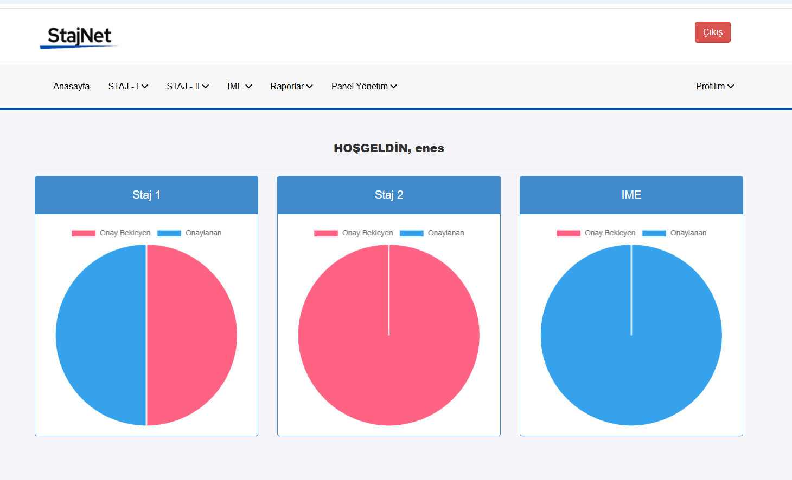

# StajNet - Online Staj Otomasyonu

## Proje Açıklaması
StajNet, ASP.NET MVC ile geliştirilmiş profesyonel bir staj başvuru ve takip sistemidir. Platform, öğrencilere ve yöneticilere staj süreçlerini kolaylaştıran kapsamlı bir çözüm sunar.

## Özellikler

### Kullanıcı Özellikleri
- Staj başvurusu yapma
- Başvuru durumunu görüntüleme
- Staj raporlarını yükleme
- Danışman ile mesajlaşma
- Belgeler indirebilme

### Admin Özellikleri
- Staj başvurularını onaylama/reddetme
- Onaylı başvuruları görüntüleme
- Staj raporlarını inceleme
- Kullanıcılara belge ekleme
- Başvuru reddi durumunda not düşme
- Kullanıcılara mesaj gönderme

## Kurulum ve Başlangıç

### Ön Gereksinimler
- Visual Studio
- .NET Framework
- SQL Server

### Kurulum Adımları
1. Projeyi klonlayın veya indirin
2. `Staj_Otomasyon.bak` veritabanını SQL Server'a aktarın
3. `/Models/User.cs` içindeki connection string'i kendi veritabanı bağlantınızla değiştirin
4. E-posta yapılandırmasını tamamlayın
5. Projeyi Visual Studio'da çalıştırın

### Veritabanı Kurulumu
- `Staj_Otomasyon.bak` dosyasını SQL Server'a geri yükleyin
- Connection string'i güncelleyin

### E-posta Yapılandırması

#### Gmail SMTP Ayarları
Proje, şifre sıfırlama işlemleri için Gmail SMTP sunucusunu kullanmaktadır. Doğru çalışması için aşağıdaki adımları izleyin:

1. **İki Faktörlü Kimlik Doğrulamayı Etkinleştirin**
   - Gmail hesabınızda Ayarlar > Güvenlik bölümüne gidin
   - "İki faktörlü doğrulamayı" etkinleştirin

2. **Uygulama Şifresi Oluşturun**
   - İki faktörlü doğrulama etkinleştirildikten sonra, "Uygulama şifreleri" bölümüne gidin
   - "Başka bir uygulama (özel)" seçeneğini seçin
   - "Oluştur" düğmesine tıklayın
   - Çıkan 16 haneli şifreyi not alın

3. **LoginController.cs Güncelleme**
   `/Controllers/LoginController.cs` dosyasındaki `SendResetMail` metodunda aşağıdaki bilgileri güncelleyin:

   ```csharp
   // Gmail hesabınızın e-posta adresi
   string senderEmail = "sizin_gmail_hesabiniz@gmail.com";
   
   // Uygulama şifresi (2 faktörlü kimlik doğrulamadan aldığınız 16 haneli şifre)
   string senderPassword = "UYGULAMA_SIFRENIZ";
   ```

#### Dikkat Edilmesi Gerekenler
- Uygulama şifresi, normal hesap şifrenizden farklıdır
- Uygulama şifresi 16 haneli ve boşluksuz olmalıdır
- Güvenlik nedeniyle uygulama şifrenizi kimseyle paylaşmayın
- Gerektiğinde uygulama şifresini yenileyebilirsiniz

## Kullanılan Teknolojiler
- ASP.NET MVC
- C#
- Entity Framework
- SQL Server
- HTML/CSS/JavaScript

## Ekran Görüntüleri

### Giriş Ekranı


### Kullanıcı Paneli


### Staj Başvuru Formu


### Staj Başvuru Durumu


### Staj Rapor Yükleme


### Staj Belgeleri


### Admin Giriş


### Admin Başvuru Görüntüleme


### Admin Panel Yönetim


### Admin Panel Yönetim - 2


## Lisans
Bu proje MIT Lisansı altında yayınlanmıştır. Detaylar için [LICENSE](LICENSE) dosyasını inceleyiniz.

**Not:** Projeyi kullanmadan önce mutlaka konfigürasyon ayarlarını kontrol ediniz.
